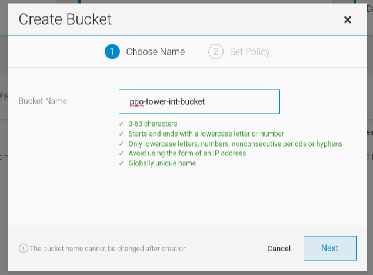
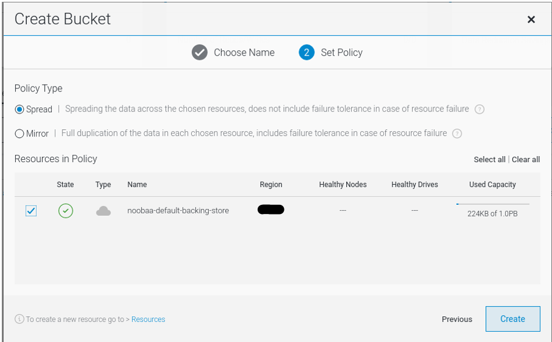
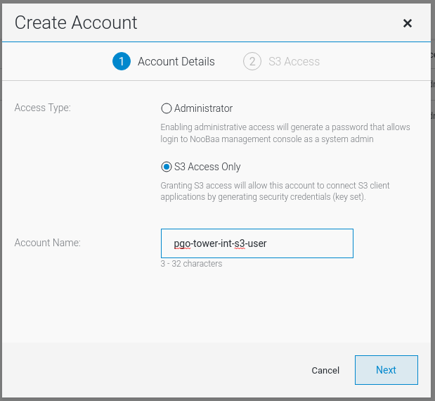
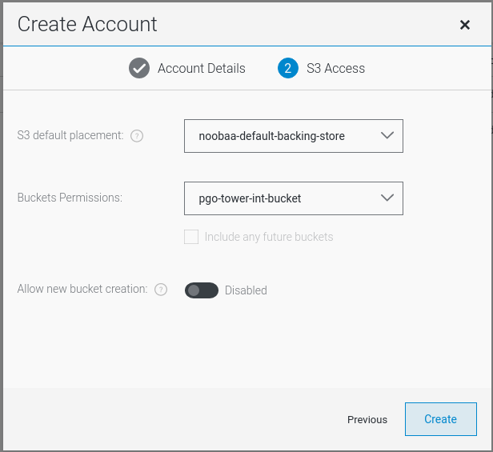

**Table of content:**

- [Introduction](#introduction)
- [Building Postgresql Cluster for Ansible Tower using CrunchyData PostgreSQL Operator](#building-postgresql-cluster-for-ansible-tower-using-crunchydata-postgresql-operator)
- [Create a Manual Backup on same cluster](#create-a-manual-backup-on-same-cluster)
- [Restore From a Backup on same cluster](#restore-from-a-backup-on-same-cluster)
- [Enable Disaster Recovery Site](#enable-disaster-recovery-site)
- [Enable Primary Site](#enable-primary-site)
- [Functionality Tests](#functionality-tests)
  - [Disaster Recovery Test](#disaster-recovery-test)

## Introduction
This procedure was prepared for deploying PostgreSQL for Ansible Tower high avilability and disaster recovery on Openshift 4.x platform using CrunchyData Postgresql Operator.
Here there are the instructions how to build Primary and disaster recovery structure and steps to perform in case of disaster and revert back to primary when needed.

In this solution, S3 Buckets on OCS 4.6 is being used for DR replication.

** Prerequsites: 

- Openshift with OCS 4.6 or above is needed
- Firewall should be opened - if exists - from Primary site application worker nodes to DR site application load balancer for NodePort. 
- CrunchyData credential for pulling images

References:
 - [CrunchyData PGO Tutorial Page](https://access.crunchydata.com/documentation/postgres-operator/v5/tutorial/)

<br>


## Building Postgresql Cluster for Ansible Tower using CrunchyData PostgreSQL Operator

1. On Primary and DR Sites in Openshift Storage project, set nodeport manually to the same value so in case needed to switch sites, so each can reach S3 bucket through NodePort to others.. Service name is "s3" and port "s3-https nodePort is set to 31974.
   Normally, S3 bucket will be used should be the one on DR site.
   ```
    spec:
    ...
    ports:
        ...
        - name: s3-https
        protocol: TCP
        port: 443
        targetPort: 6443
        nodePort: 31974
        ...
   ```

2. Add NodePort to Primary and DR Application LoadBalancer to point OCS (ODF) nodes only and restart haproxy.

    - Disaster Recovery Site Load Balancer
    ```
    # vim /etc/haproxy/haproxy.conf
        frontend s3-nodeport-svc
        bind *:31974
        default_backend s3-nodeport-svc
        mode tcp
        option tcplog

        backend s3-nodeport-svc
        balance source
        mode tcp
        server wnd061ccpr1 10.1.90.156:31974 check
        server wnd071ccpr1 10.1.90.157:31974 check
        server wnd081ccpr1 10.1.90.158:31974 check   
    #  systemctl restart haproxy       
    ```
    
    - Primary Site Load Balancer
    ```
    # vim /etc/haproxy/haproxy.conf
        frontend s3-nodeport-svc
        bind *:31974
        default_backend s3-nodeport-svc
        mode tcp
        option tcplog

        backend s3-nodeport-svc
        balance source
        mode tcp
        server wnd061ccpr1 10.2.90.156:31974 check
        server wnd071ccpr1 10.2.90.157:31974 check
        server wnd081ccpr1 10.2.90.158:31974 check   
    #  systemctl restart haproxy       
    ```

3. Login to Noobaa Web Interface at DR site to create a bucket and user for Postgresql Operator. Url can be reachable from Google Chrome only. Access can be granted by using kubeadmin or any openshift admin userid.
    
    https://noobaa-mgmt-openshift-storage.apps.oc4.cluster.local/

4. Create bucket for PGO
   
    
   

5. Create a new account for operator to use and create new bucket with giving user access. Note down Access and Secret keys for postgresql configuration.
   
    
   

6. Create a new project on both sites for PGO deployment. 
   ```
   % oc new-project pgo-int
   ```

7. Create a pull secret for CrunchyData repository and add secret name to selectors.yaml file. 
   ```
   % oc create secret docker-registry crunchydata-pull-secret \
        --docker-username=user@example.com \
        --docker-password=***** \
        --docker-server=registry.crunchydata.com \
        --namespace=pgo-int
        secret/crunchydata-pull-secret created  
   % cat install/singlenamespace/selectors.yaml
      # We add the app version as a "commonLabel" and change it with each release.
      # Remove it from selectors until we use "labels" of Kustomize v4.1.
      # See: https://kubectl.docs.kubernetes.io/references/kustomize/kustomization/commonlabels/
      # See: https://github.com/kubernetes-sigs/kustomize/releases/tag/kustomize%2Fv4.1.0
      - op: remove
        path: /spec/selector/matchLabels/app.kubernetes.io~1name
      - op: remove
        path: /spec/selector/matchLabels/app.kubernetes.io~1version
      - op: add
        path: /spec/template/spec/imagePullSecrets
        value:
          - name: crunchydata-pull-secret
   ```

8. Prepare singlenamespace kustomization file for PGO deployment using kustomize
   ```
   # cat install/singlenamespace/kustomization.yaml
    namespace: pgo-int

    commonLabels:
      app.kubernetes.io/name: pgo-int
      app.kubernetes.io/version: 5.0.5

    bases:
    - ../crd
    - ../rbac/namespace
    - ../manager

    images:
    - name: postgres-operator
      newName: registry.crunchydata.com/crunchydata/postgres-operator
      newTag: ubi8-5.0.5-0
    - name: postgres-operator-upgrade
      newName: registry.crunchydata.com/crunchydata/postgres-operator-upgrade
      newTag: ubi8-5.1.0-0

    patchesJson6902:
    - target: { group: apps, version: v1, kind: Deployment, name: pgo }
      path: selectors.yaml
    - target: { group: apps, version: v1, kind: Deployment, name: pgo-upgrade }
      path: selectors.yaml

    patchesStrategicMerge:
    - manager-target.yaml
    - manager-target-upgrade.yaml

   ```

9.  Deploy Operator with kustomize on both environments (Primary and Disaster recovery sites).
  ```
  # oc apply -k install/singlenamespace
    customresourcedefinition.apiextensions.k8s.io/pgupgrades.postgres-operator.crunchydata.com unchanged
    serviceaccount/pgo unchanged
    serviceaccount/postgres-operator-upgrade unchanged
    role.rbac.authorization.k8s.io/postgres-operator-upgrade configured
    role.rbac.authorization.k8s.io/postgres-operator unchanged
    rolebinding.rbac.authorization.k8s.io/postgres-operator-upgrade unchanged
    rolebinding.rbac.authorization.k8s.io/postgres-operator unchanged
    deployment.apps/pgo-upgrade configured
    deployment.apps/pgo configured
    The CustomResourceDefinition "postgresclusters.postgres-operator.crunchydata.com" is invalid: metadata.annotations: Too long: must have at most 262144 bytes

  # oc create -k install/singlenamespace
    customresourcedefinition.apiextensions.k8s.io/postgresclusters.postgres-operator.crunchydata.com created
    Error from server (AlreadyExists): error when creating "install/singlenamespace": customresourcedefinitions.apiextensions.k8s.io "pgupgrades.postgres-operator.crunchydata.com" already exists
    Error from server (AlreadyExists): error when creating "install/singlenamespace": serviceaccounts "pgo" already exists
    Error from server (AlreadyExists): error when creating "install/singlenamespace": serviceaccounts "postgres-operator-upgrade" already exists
    Error from server (AlreadyExists): error when creating "install/singlenamespace": roles.rbac.authorization.k8s.io "postgres-operator-upgrade" already exists
    Error from server (AlreadyExists): error when creating "install/singlenamespace": roles.rbac.authorization.k8s.io "postgres-operator" already exists
    Error from server (AlreadyExists): error when creating "install/singlenamespace": rolebindings.rbac.authorization.k8s.io "postgres-operator-upgrade" already exists
    Error from server (AlreadyExists): error when creating "install/singlenamespace": rolebindings.rbac.authorization.k8s.io "postgres-operator" already exists
    Error from server (AlreadyExists): error when creating "install/singlenamespace": deployments.apps "pgo-upgrade" already exists
    Error from server (AlreadyExists): error when creating "install/singlenamespace": deployments.apps "pgo" already exists

  ```   
  Note: CRD creation has an error. Should be reported to CrunchyData. tried oc create -k 
  
10. Prepare postgresql deployment files which uses S3 Buckets. Kustomize will be used for database deployment. Files are located under kustomize/s3/ path. Following changes should be done on mentioned files.
  
    - Edit [s3.conf](files/postgresql-tower-int-kustomize/s3/s3.conf) file and define s3 access key and secret key variables you gathered at step 4. Alternatively; you can navigate at noobaa web page to Buckets and than click Connect Application button. Be sure you selected correct account you created at step 4.
    - Edit [kustomization.yaml](files/postgresql-tower-int-kustomize/s3/kustomization.yaml) file. Correct namespace and s3 secret name.
    ```
    % cat kustomization.yaml 
    namespace: pgo-int

    secretGenerator:
    - name: pgo-s3-creds-e1
      files:
      - s3.conf

    generatorOptions:
      disableNameSuffixHash: true

    resources:
    - postgres.yaml

    ```
    - Edit [postgres.yaml](files/postgresql-tower-int-kustomize/s3/postgres.yaml) file for database deployment settings.
    ```
    # cat s3/postgres.yaml
    apiVersion: postgres-operator.crunchydata.com/v1beta1
    kind: PostgresCluster
    metadata:
      name: postgresql-tower-int
    spec:
      shutdown: false
      openshift: true
      standby:
        enabled: false
        repoName: repo2

      image: registry.crunchydata.com/crunchydata/crunchy-postgres:ubi8-10.19-0
      imagePullSecrets:
        - name: crunchydata-pull-secret
      postgresVersion: 10

      instances:
        - name: instance1
          authentication:
            sslmode: 'prefer'
          resources:
            limits:
              memory: 8Gi
          replicas: 2
          dataVolumeClaimSpec:
            accessModes:
            - "ReadWriteOnce"
            resources:
              requests:
                storage: 500Gi
          walVolumeClaimSpec:
            accessModes:
            - "ReadWriteOnce"
            resources:
              requests:
                storage: 100G

      backups:
        pgbackrest:
          image: registry.crunchydata.com/crunchydata/crunchy-pgbackrest:ubi8-5.0.4-0

          repos:
          - name: repo1
            schedules:
              full: "0 0 * * 0"
              # replace "incremental:" with "differential:" if you want to use differential backup scheme
              incremental: "0 0 * * 1-6"
            volume:
              volumeClaimSpec:
                accessModes:
                - "ReadWriteOnce"
                resources:
                  requests:
                    storage: 1Ti
          - name: repo2
            s3:
              bucket: "pgo-tower-int-bucket"
              endpoint: "10.1.90.154:31974"
              region: "localcluster"

          global:
            # Keep full backup for 2 weeks, diff or inc backups are deleted with related full backup
            repo1-retention-full: "15"
            repo1-retention-full-type: time
            delta: "y"
            # Uncomment following 2 lines to enable zstd compression
            #compress-type: zst
            #compress-level: 1

            # S3 bucket for disaster recovery
            #repo2-path: /pgbackrest/postgres-operator/postgresql-tower-int-s3/repo2
            repo2-storage-verify-tls: "n"
            repo2-s3-uri-style: "path"
            repo2-retention-full: "15"
            repo2-retention-full-type: time

          configuration:
          - secret:
              name: pgo-s3-creds-e1

          manual:
            repoName: repo1
            options:
            - --type=full

          restore:
            enabled: false
            repoName: repo1
            options:
            - --type=time
            - --target="2022-05-23 08:49:24+00"

      patroni:
        dynamicConfiguration:
          postgresql:
            parameters:
              max_parallel_workers: 2
              max_connections: 2048
              max_worker_processes: 2
              shared_buffers: 2GB
              work_mem: 2MB
              password_encryption: md5
              archive_timeout: 600
            pg_hba: ["local all all      trust","host postgresql-tower-int admin 10.128.0.0/14 md5","host postgresql-tower-int cacf_mon 10.128.0.0/14 md5"]
      monitoring:
        pgmonitor:
          exporter:
            image: registry.crunchydata.com/crunchydata/crunchy-postgres-exporter:ubi8-5.0.4-0
    ```

    ** standby section should be set as following for DR instance
    ```
      standby:
        enabled: true
        repoName: repo2    
    ```

11. Deploy postgresql to Primary Site first
    ```
    % oc apply -k s3/
    secret/pgo-s3-creds-e1 created
    postgrescluster.postgres-operator.crunchydata.com/postgresql-tower created

    ``` 

12. Backup and restore Ansible Tower db from manual database dump.
    ```
    # oc get pods -l postgres-operator.crunchydata.com/role=master
    NAME                                    READY   STATUS    RESTARTS   AGE
    postgresql-tower-int-instance1-p9mt-0   4/4     Running   0          49m
    # oc cp tower-int.db postgresql-tower-int-instance1-p9mt-0:/pgdata/tower-int.db
    Defaulting container name to database.
    
    # oc rsh postgresql-tower-int-instance1-p9mt-0
    Defaulting container name to database.
    Use 'oc describe pod/postgresql-tower-int-instance1-p9mt-0 -n pgo-int' to see all of the containers in this pod.
    sh-4.4$ cd /pgdata
    sh-4.4$ ls
    nss_wrapper  postgres  postgres_exporter.pid  queries.yml  replication	sshd.pid  tower-int.db
    sh-4.4$ pg_restore -v -j 10 --dbname="postgresql-tower-int" --clean /pgdata/tower-int.db

    ```

13. Create admin user on Primary DB for the first time.    
    ```
    # oc rsh postgresql-tower-int-instance1-jfd6-0
    Defaulting container name to database.
    Use 'oc describe pod/postgresql-tower-int-instance1-jfd6-0 -n pgo-int' to see all of the containers in this pod.
    sh-4.4$ psql -d postgresql-tower-int
    psql (10.19)
    SSL connection (protocol: TLSv1.3, cipher: TLS_AES_256_GCM_SHA384, bits: 256, compression: off)
    Type "help" for help.

    postgresql-tower-int=# CREATE USER admin WITH SUPERUSER PASSWORD 'production postgresql admin pwds from previous tower deployment';
    CREATE ROLE

    ```

14. Check from repo-host pod and wait for backup will be completed. After restore backup will be triggered for repo1 and trigger for repo2 manually with following command after backup to repo1 completed.
    ```
      # oc rsh postgresql-tower-int-repo-host-0
      sh-4.4$ pgbackrest info
      stanza: db
          status: error (no valid backups, backup/expire running)
          cipher: none

          db (current)
              wal archive min/max (10): 000000010000000000000001/000000010000000000000041
      $ ps -ef | grep "pgbackrest backup"
      postgres      36       0  0 12:00 ?        00:00:00 bash -ceu --  shopt -s globstar files=(/etc/pgbackrest/conf.d/**) for i in "${!files[@]}"; do ?[[ -f "${files[$i]}" ]] || unset -v "files[$i]" done declare -r hash="$1" local_hash="$(sha1sum "${files[@]}" | sha1sum)"  if [[ "${local_hash}" != "${hash}" ]]; then ?printf >&2 "hash %s does not match local hash %s" "${hash}" "${local_hash}"; exit 1; else ?pgbackrest backup --stanza=db --repo=1 fi  - 273cf6d3c81e8ad1ae28c26ad540659aaf092a32  -
      postgres      46      36  0 12:00 ?        00:00:00 pgbackrest backup --stanza=db --repo=1
      postgres     535     330  0 12:04 pts/1    00:00:00 grep pgbackrest backup
      $ pgbackrest info
      stanza: db
          status: mixed
              repo1: ok
              repo2: error (no valid backups)
          cipher: none

          db (current)
              wal archive min/max (10): 000000010000000000000001/00000001000000010000000D

              full backup: 20220518-120016F
                  timestamp start/stop: 2022-05-18 12:12:22 / 2022-05-18 12:14:31
                  wal start/stop: 00000001000000010000000D / 00000001000000010000000D
                  database size: 2.8GB, database backup size: 2.8GB
                  repo1: backup set size: 615.2MB, backup size: 615.2MB
      $ pgbackrest backup --stanza=db --repo=2
      WARN: no prior backup exists, incr backup has been changed to full
      $ pgbackrest info
      stanza: db
          status: ok
          cipher: none

          db (current)
              wal archive min/max (10): 000000010000000000000001/00000001000000010000000F

              full backup: 20220518-120016F
                  timestamp start/stop: 2022-05-18 12:12:22 / 2022-05-18 12:14:31
                  wal start/stop: 00000001000000010000000D / 00000001000000010000000D
                  database size: 2.8GB, database backup size: 2.8GB
                  repo1: backup set size: 615.2MB, backup size: 615.2MB

              full backup: 20220518-121638F
                  timestamp start/stop: 2022-05-18 12:16:38 / 2022-05-18 12:19:37
                  wal start/stop: 00000001000000010000000F / 00000001000000010000000F
                  database size: 2.8GB, database backup size: 2.8GB
            repo2: backup set size: 615.2MB, backup size: 615.2MB
    ```

15. Deploy Ansible tower with official method and use secret postgresql-tower-pguser-admin to fill database related parts or edit secret with new db details.
    - new deployment's inventory file
    ```
    # Database Settings
    # =================

    # Set pg_hostname if you have an external postgres server, otherwise
    # a new postgres service will be created
    pg_hostname=<host variable from secret postgresql-tower-pguser-admin >

    # If using an external database, provide your existing credentials.
    # If you choose to use the provided containerized Postgres depolyment, these
    # values will be used when provisioning the database.
    pg_username='admin'
    pg_password='admin password from old deployment - created at step 13'
    pg_database=<dbname variable from secret postgresql-tower-pguser-admin >
    pg_port=5432
    pg_sslmode='prefer'  # set to 'verify-full' for client-side enforced SSL

    ```
    - Secret ansible-tower-secrets should be changed. There are 2 scripts (credentials_py and environment_sh) with db data inside the secret. Update relevant data there.

16. Scale up your Ansible Tower deployment.
    ```
    % ./setup_openshift.sh
    ```
    ** If environment has a http proxy no_proxy should be defined. Otherwise installation will fail.
    ```
    % export no_proxy=10.1.90.153,.oc4.cluster.local,10.0.0.0/8,127.0.0.1,localhost
    ```

    ```
    % oc scale --replicas=1 deployment/ansible-tower -n tower-int
    ```

17. Make sure Ansible Tower on DR site is scaled down.
    ```
    % oc scale --replicas=0 deployment/ansible-tower -n tower-int

18. With following same steps from Step 11 deploy DR Site as well. Do not restore db on DR. It will be restored by operator using S3 Bucket.
    
19. Update postgresql-tower-int-pguser-admin secret on DR site to have right value on both ends. Openshift UI can be used.
    
20. [OPTIONAL] To Check replication, connect to DR postgresql pod and postgresql database and check database content.
    ```
    # oc project tower-dr
    Now using project "tower-dr" on server "https://api.oc4.cluster.local:6443".
    # oc get pods
    NAME                                 READY   STATUS      RESTARTS   AGE
    pgo-55cf944576-pqt5m                 1/1     Running     0          3d
    postgresql-tower-backup-t974-5v6nh   0/1     Completed   0          2d1h
    postgresql-tower-primary-q959-0      2/2     Running     0          2d1h
    # oc rsh postgresql-tower-primary-q959-0
    Defaulting container name to database.
    Use 'oc describe pod/postgresql-tower-primary-q959-0 -n tower-dr' to see all of the containers in this pod.
    sh-4.4$ psql -h postgresql-tower-int-primary.pgo-int.svc -U admin -d postgresql-tower-int
    Password for user admin:
    psql (10.18)
    SSL connection (protocol: TLSv1.3, cipher: TLS_AES_256_GCM_SHA384, bits: 256, compression: off)
    Type "help" for help.

    postgresql-tower=# select * from auth_user where id=198;
    id  |                                    password                                    | last_login | is_superuser | username | first_name | last_name |        email        | is_st
    aff | is_active |          date_joined
    -----+--------------------------------------------------------------------------------+------------+--------------+----------+------------+-----------+---------------------+------
    ----+-----------+-------------------------------
    198 | pbkdf2_sha256$150000$TnukMwglO9JV$TbfMotQhhKGYA0AuwJcG/4HKgy9mR+W8YeKqvQpvZBw= |            | f            | test-pr  | test-pr    |           | test-pr@example.com | f
        | t         | 2021-10-26 09:04:47.918091+00
    (1 row)

    ```

## Create a Manual Backup on same cluster

1. Login to Openshift cluster and switch to PGO Cluster namespace
   ```
   # oc login --token=sha256~XvyB_AsmRcsmDI2w6rsmK9jjE7vYzRSEpa5m_cV7cl0 --server=https://api.oc4.cluster.local:6443
   Logged into "https://api.oc4.cluster.local:6443" as "PLZZ00LK" using the token provided.

   You have access to 87 projects, the list has been suppressed. You can list all projects with ' projects'

   Using project "pgo-int".

   ```
2. Run following command to start backup. Scale Ansible Tower down if needed.
   ```
   # oc scale --replicas=0 deployment/ansible-tower -n tower-int
   # oc annotate -n pgo-int postgrescluster postgresql-tower-int  --overwrite postgres-operator.crunchydata.com/pgbackrest-backup="$(date)"
   ```
3. Backup process can be followed as below. Dedicated backup pod should be in completed status after backup has been completed.
   ```
    # oc get pods
    NAME                                                          READY   STATUS             RESTARTS   AGE
    ...
    postgresql-tower-int-backup-lvg6-6rphp                        1/1     Running            0          9s
    ...
    
    # oc logs -f postgresql-tower-int-backup-lvg6-6rphp
    time="2022-05-23T08:42:49Z" level=info msg="crunchy-pgbackrest starts"
    time="2022-05-23T08:42:49Z" level=info msg="debug flag set to false"
    time="2022-05-23T08:42:50Z" level=info msg="backrest backup command requested"
    time="2022-05-23T08:42:50Z" level=info msg="command to execute is [pgbackrest backup --stanza=db --repo=1 --type=full]"
    time="2022-05-23T08:43:39Z" level=info msg="output=[]"
    time="2022-05-23T08:43:39Z" level=info msg="stderr=[]"
    time="2022-05-23T08:43:39Z" level=info msg="crunchy-pgbackrest ends"

    # oc get pods
    NAME                                                          READY   STATUS             RESTARTS   AGE
    ...
    postgresql-tower-int-backup-lvg6-6rphp                        0/1     Completed          0          3m40s
    ...
   ```

4. Backup can be checked from pgbackrest pod.
   ```
   # oc get pods
    NAME                                                          READY   STATUS             RESTARTS   AGE
    ...
    postgresql-tower-int-repo-host-0                              1/1     Running            0          2d20h
    ...

    # oc rsh postgresql-tower-int-repo-host-0
    sh-4.4$ pgbackrest info
    stanza: db
        status: ok
        cipher: none

        db (current)
            wal archive min/max (10): 000000010000000000000001/0000000300000001000000DB

            full backup: 20220520-112325F
                timestamp start/stop: 2022-05-20 11:23:25 / 2022-05-20 11:25:11
                wal start/stop: 000000010000000000000032 / 000000010000000000000032
                database size: 509.9MB, database backup size: 509.9MB
                repo2: backup set size: 63.5MB, backup size: 63.5MB

            full backup: 20220520-120748F
                timestamp start/stop: 2022-05-20 12:07:48 / 2022-05-20 12:08:38
                wal start/stop: 00000003000000000000003A / 00000003000000000000003A
                database size: 510.8MB, database backup size: 510.8MB
                repo1: backup set size: 63.6MB, backup size: 63.6MB

            incr backup: 20220520-120748F_20220521-000008I
                timestamp start/stop: 2022-05-21 00:00:08 / 2022-05-21 00:00:16
                wal start/stop: 000000030000000000000083 / 000000030000000000000083
                database size: 513.1MB, database backup size: 71.5MB
                repo1: backup set size: 63.8MB, backup size: 7.5MB
                backup reference list: 20220520-120748F

            full backup: 20220522-000008F
                timestamp start/stop: 2022-05-22 00:00:08 / 2022-05-22 00:00:54
                wal start/stop: 000000030000000100000014 / 000000030000000100000014
                database size: 517.6MB, database backup size: 517.6MB
                repo1: backup set size: 64MB, backup size: 64MB

            incr backup: 20220522-000008F_20220523-000007I
                timestamp start/stop: 2022-05-23 00:00:07 / 2022-05-23 00:00:15
                wal start/stop: 0000000300000001000000A5 / 0000000300000001000000A5
                database size: 522.1MB, database backup size: 112.9MB
                repo1: backup set size: 64.4MB, backup size: 9.4MB
                backup reference list: 20220522-000008F

            full backup: 20220523-084252F
                timestamp start/stop: 2022-05-23 08:42:52 / 2022-05-23 08:43:37
                wal start/stop: 0000000300000001000000DB / 0000000300000001000000DB
                database size: 523.7MB, database backup size: 523.7MB
                repo1: backup set size: 64.5MB, backup size: 64.5MB     
   ```   
5. Scale up Ansible tower
   ```
   # oc scale --replicas=1 deployment/ansible-tower -n tower-int
   ```

## Restore From a Backup on same cluster

1. Following line in postgresql.yaml file should be fixed accordign to the backup will be restored. Related information can be gathered from pgbackrest command as showed below.
   ```
   # oc get pods
    NAME                                                          READY   STATUS             RESTARTS   AGE
    ...
    postgresql-tower-int-repo-host-0                              1/1     Running            0          2d21h

   # oc exec postgresql-tower-int-repo-host-0 -- pgbackrest info
    stanza: db
        status: ok
        cipher: none

        db (current)
            wal archive min/max (10): 000000010000000000000001/0000000300000001000000DF

            ...

            full backup: 20220523-084924F
                timestamp start/stop: 2022-05-23 08:49:24 / 2022-05-23 08:50:07
                wal start/stop: 0000000300000001000000DD / 0000000300000001000000DD
                database size: 523.7MB, database backup size: 523.7MB
                repo1: backup set size: 64.5MB, backup size: 64.5MB

   # cat s3/postgres.yaml | grep -A5 restore
      restore:
        enabled: true
        repoName: repo1
        options:
        - --type=time
        - --target="2022-05-23 08:49:24+00"   

   # oc apply -k s3/
    secret/pgo-s3-creds-e1 unchanged
    postgrescluster.postgres-operator.crunchydata.com/postgresql-tower-int configured
 
   ```

2. Trigger restore with setting annotation.
   ```
   # oc scale --replicas=0 deployment/ansible-tower -n tower-int
   # oc annotate -n pgo-int postgrescluster postgresql-tower-int --overwrite postgres-operator.crunchydata.com/pgbackrest-restore=id1
   ```

3. Restore process can be followed as below. Dedicated restore pod should be in completed status after restore has been completed. 
   ```
   # oc get pods
    NAME                                                          READY   STATUS         RESTARTS   AGE
    ...
    postgresql-tower-int-pgbackrest-restore-mbsh2                 0/1     Running          0          0s


    # oc logs -f postgresql-tower-int-pgbackrest-restore-mbsh2
    2022-05-23 09:33:35.382 GMT [19] LOG:  listening on IPv6 address "::1", port 5432
    2022-05-23 09:33:35.382 GMT [19] LOG:  listening on IPv4 address "127.0.0.1", port 5432
    2022-05-23 09:33:35.387 GMT [19] LOG:  listening on Unix socket "/tmp/.s.PGSQL.5432"
    2022-05-23 09:33:35.478 GMT [20] LOG:  database system was interrupted; last known up at 2022-05-23 08:42:53 GMT
    2022-05-23 09:33:35.608 GMT [20] LOG:  starting point-in-time recovery to 2022-05-23 08:49:24+00
    2022-05-23 09:33:36.152 GMT [20] LOG:  restored log file "00000003.history" from archive
    2022-05-23 09:33:36.641 GMT [20] LOG:  restored log file "0000000300000001000000DB" from archive
    2022-05-23 09:33:36.793 GMT [20] LOG:  redo starts at 1/DB000028
    2022-05-23 09:33:36.797 GMT [20] LOG:  consistent recovery state reached at 1/DB005E10
    2022-05-23 09:33:36.798 GMT [19] LOG:  database system is ready to accept read only connections
    2022-05-23 09:33:37.153 GMT [20] LOG:  restored log file "0000000300000001000000DC" from archive
    2022-05-23 09:33:37.662 GMT [20] LOG:  restored log file "0000000300000001000000DD" from archive
    2022-05-23 09:33:37.807 GMT [20] LOG:  recovery stopping before commit of transaction 58987, time 2022-05-23 08:49:30.73528+00
    2022-05-23 09:33:37.807 GMT [20] LOG:  redo done at 1/DD0000D0
    2022-05-23 09:33:37.807 GMT [20] LOG:  last completed transaction was at log time 2022-05-23 08:49:20.702553+00
    2022-05-23 09:33:38.093 GMT [20] LOG:  restored log file "00000004.history" from archive
    2022-05-23 09:33:38.375 GMT [20] LOG:  restored log file "00000005.history" from archive
    2022-05-23 09:33:38.663 GMT [20] LOG:  selected new timeline ID: 6
    2022-05-23 09:33:38.859 GMT [20] LOG:  archive recovery complete
    2022-05-23 09:33:39.156 GMT [20] LOG:  restored log file "00000003.history" from archive
    2022-05-23 09:33:39.495 GMT [19] LOG:  database system is ready to accept connections
    2022-05-23 09:33:39.508 GMT [54] LOG:  archive command failed with exit code 1
    2022-05-23 09:33:39.508 GMT [54] DETAIL:  The failed archive command was: false
    2022-05-23 09:33:40.513 GMT [54] LOG:  archive command failed with exit code 1
    2022-05-23 09:33:40.513 GMT [54] DETAIL:  The failed archive command was: false
    2022-05-23 09:33:40.978 GMT [19] LOG:  received fast shutdown request
    2022-05-23 09:33:40.981 GMT [19] LOG:  aborting any active transactions
    2022-05-23 09:33:40.983 GMT [19] LOG:  worker process: logical replication launcher (PID 55) exited with exit code 1
    2022-05-23 09:33:40.984 GMT [25] LOG:  shutting down
    2022-05-23 09:33:41.202 GMT [54] LOG:  archive command failed with exit code 1
    2022-05-23 09:33:41.202 GMT [54] DETAIL:  The failed archive command was: false
    2022-05-23 09:33:41.202 GMT [54] WARNING:  archiving write-ahead log file "00000006.history" failed too many times, will try again later
    2022-05-23 09:33:41.214 GMT [54] LOG:  archive command failed with exit code 1
    2022-05-23 09:33:41.214 GMT [54] DETAIL:  The failed archive command was: false
    2022-05-23 09:33:41.616 GMT [54] LOG:  archive command failed with exit code 1
    2022-05-23 09:33:41.616 GMT [54] DETAIL:  The failed archive command was: false
    2022-05-23 09:33:42.621 GMT [54] LOG:  archive command failed with exit code 1
    2022-05-23 09:33:42.621 GMT [54] DETAIL:  The failed archive command was: false
    2022-05-23 09:33:42.621 GMT [54] WARNING:  archiving write-ahead log file "00000006.history" failed too many times, will try again later
    2022-05-23 09:33:42.626 GMT [54] LOG:  archive command failed with exit code 1
    2022-05-23 09:33:42.626 GMT [54] DETAIL:  The failed archive command was: false
    2022-05-23 09:33:43.632 GMT [54] LOG:  archive command failed with exit code 1
    2022-05-23 09:33:43.632 GMT [54] DETAIL:  The failed archive command was: false
    2022-05-23 09:33:44.636 GMT [54] LOG:  archive command failed with exit code 1
    2022-05-23 09:33:44.636 GMT [54] DETAIL:  The failed archive command was: false
    2022-05-23 09:33:44.637 GMT [54] WARNING:  archiving write-ahead log file "00000006.history" failed too many times, will try again later
    2022-05-23 09:33:44.654 GMT [19] LOG:  database system is shut down

   ```

4. Scale up Ansible tower
   ```
   # oc scale --replicas=1 deployment/ansible-tower -n tower-int
   ```

5. Set restore as "false" in postgresql.yaml file and apply changes.
   ```
   # cat s3/postgres.yaml | grep -A5 restore
      restore:
        enabled: false
        repoName: repo1
        options:
        - --type=time
        - --target="2022-05-23 08:49:24+00"
   # oc apply -k s3/
    secret/pgo-s3-creds-e1 unchanged
    postgrescluster.postgres-operator.crunchydata.com/postgresql-tower-int configured
        
   ```

## Enable Disaster Recovery Site

In disaster case, Primary database will be lost. Postgresql on Dr site with Ansible tower should be set as primary manually.

1. On Disaster Recovery installation server, switch to pgo filesystem (example: /ansible_tower/pgo/postgresql-tower-int-kustomize). Change DR postgresql yaml [file](files/postgres-operator-examples/kustomize/s3/postgres.yaml) and be sure Standby set to false.
   ```
        shutdown: false
        .....
         standby:
            enabled: false
            repoName: repo1     
   ```

2. Deploy settings.
   ```
   $ oc apply -k s3-dr/
   ```

3. Scale up Ansible Tower on DR Site.
   ```
   $ oc scale --replicas=1 deployment/ansible-tower -n tower-int
   ```

## Enable Primary Site

To prevent split brain; Primary site should be redeployed as standby and than promote as master after replication ends.

1. Delete postgresql deployment.
  ```
    % oc delete -k s3/
    secret "pgo-s3-creds-e1" deleted
    postgrescluster.postgres-operator.crunchydata.com "postgresql-tower-int" deleted

  ```

2. Deploy Primary postgresql as standby and wait for restore to be completed from S3 Bucket.

  ```
    % cat s3/postgres.yaml 
        shutdown: false
        .....
         standby:
            enabled: true
            repoName: repo2  

    % oc apply -k s3/
    secret/pgo-s3-creds-e1 created
    postgrescluster.postgres-operator.crunchydata.com/postgresql-tower-int created
  ```

3. Postgresql pod logs can be checked to see if restore ended or not. Pod logs should have following entry "standby with lock"
  ```
  # oc project tower-dr
  Now using project "tower-dr" on server "https://api.oc4.cluster.local:6443".
  # oc get pods
  NAME                                 READY   STATUS      RESTARTS   AGE
  pgo-55cf944576-pqt5m                 1/1     Running     0          3d3h
  postgresql-tower-backup-t974-5v6nh   0/1     Completed   0          2d4h
  postgresql-tower-primary-q959-0      2/2     Running     0          2d4h

  # oc logs postgresql-tower-primary-q959-0 -c database 

  2021-10-26 09:31:32,166 INFO: bootstrap (without leader) in progress
  2021-10-26 09:31:32,395 INFO: replica has been created using pgbackrest
  2021-10-26 09:31:32,397 INFO: bootstrapped (without leader)
  2021-10-26 09:31:32,411 WARNING: Removing unexpected parameter=jit value=off from the config
  2021-10-26 09:31:32.618 UTC [154] LOG:  pgaudit extension initialized
  2021-10-26 09:31:32.618 UTC [154] LOG:  listening on IPv4 address "0.0.0.0", port 5432
  2021-10-26 09:31:32.618 UTC [154] LOG:  listening on IPv6 address "::", port 5432
  2021-10-26 09:31:32,618 INFO: postmaster pid=154
  2021-10-26 09:31:32.621 UTC [154] LOG:  listening on Unix socket "/tmp/postgres/.s.PGSQL.5432"
  2021-10-26 09:31:32.655 UTC [154] LOG:  redirecting log output to logging collector process
  2021-10-26 09:31:32.655 UTC [154] HINT:  Future log output will appear in directory "log".
  /tmp/postgres:5432 - rejecting connections
  /tmp/postgres:5432 - rejecting connections
  /tmp/postgres:5432 - rejecting connections
  /tmp/postgres:5432 - rejecting connections
  /tmp/postgres:5432 - accepting connections
  2021-10-26 09:31:35,726 INFO: establishing a new patroni connection to the postgres cluster
  2021-10-26 09:31:35,730 INFO: My wal position exceeds maximum replication lag
  2021-10-26 09:31:35,805 INFO: following a different leader because i am not the healthiest node
  2021-10-26 09:31:41,529 INFO: My wal position exceeds maximum replication lag
  2021-10-26 09:31:41,604 INFO: continue following the old known standby leader
  2021-10-26 09:31:41,607 WARNING: Removing invalid parameter `jit` from postgresql.parameters
  2021-10-26 09:31:41,607 INFO: No PostgreSQL configuration items changed, nothing to reload.
  2021-10-26 09:31:52,029 INFO: My wal position exceeds maximum replication lag
  2021-10-26 09:31:52,100 INFO: continue following the old known standby leader
  2021-10-26 09:32:02,166 INFO: promoted self to a standby leader by acquiring session lock
  2021-10-26 09:32:02,167 INFO: Lock owner: postgresql-tower-primary-q959-0; I am postgresql-tower-primary-q959-0
  2021-10-26 09:32:02,278 INFO: updated leader lock during changing primary_conninfo and restarting
  2021-10-26 09:32:02,505 INFO: closed patroni connection to the postgresql cluster
  2021-10-26 09:32:02.716 UTC [242] LOG:  pgaudit extension initialized
  2021-10-26 09:32:02.717 UTC [242] LOG:  listening on IPv4 address "0.0.0.0", port 5432
  2021-10-26 09:32:02.717 UTC [242] LOG:  listening on IPv6 address "::", port 5432
  2021-10-26 09:32:02,714 INFO: postmaster pid=242
  /tmp/postgres:5432 - no response
  2021-10-26 09:32:02.725 UTC [242] LOG:  listening on Unix socket "/tmp/postgres/.s.PGSQL.5432"
  2021-10-26 09:32:02.776 UTC [242] LOG:  redirecting log output to logging collector process
  2021-10-26 09:32:02.776 UTC [242] HINT:  Future log output will appear in directory "log".
  /tmp/postgres:5432 - rejecting connections
  /tmp/postgres:5432 - rejecting connections
  /tmp/postgres:5432 - accepting connections
  2021-10-26 09:32:04,781 INFO: Lock owner: postgresql-tower-primary-q959-0; I am postgresql-tower-primary-q959-0
  2021-10-26 09:32:04,782 INFO: establishing a new patroni connection to the postgres cluster
  2021-10-26 09:32:04,902 INFO: no action. I am (postgresql-tower-primary-q959-0) the standby leader with the lock
  2021-10-26 09:32:15,329 INFO: no action. I am (postgresql-tower-primary-q959-0) the standby leader with the lock
  2021-10-26 09:32:25,330 INFO: no action. I am (postgresql-tower-primary-q959-0) the standby leader with the lock
  2021-10-26 09:32:35,331 INFO: no action. I am (postgresql-tower-primary-q959-0) the standby leader with the lock
  2021-10-26 09:32:45,330 INFO: no action. I am (postgresql-tower-primary-q959-0) the standby leader with the lock

  ```

## Functionality Tests

### Disaster Recovery Test

1. Test Primary - DR sync with creating a user and check db from DR manually

    ```
    $ oc login --token=***** --server=https://api.oc4.cluster.local:6443
    Logged into "https://api.oc4.cluster.local:6443" as "PLZZ00LK" using the token provided.

    You have access to 72 projects, the list has been suppressed. You can list all projects with ' projects'

    Using project "pgo-int".
    $ oc project pgo-int
    Already on project "pgo-int" on server "https://api.oc4.cluster.local:6443".

    $ oc get pods -l postgres-operator.crunchydata.com/role=master
    NAME                                    READY   STATUS    RESTARTS   AGE
    postgresql-tower-int-instance1-c7vc-0   4/4     Running   0          2d23h

    $ oc rsh postgresql-tower-int-instance1-c7vc-0
    Defaulting container name to database.
    Use 'oc describe pod/postgresql-tower-int-instance1-c7vc-0 -n pgo-int' to see all of the containers in this pod.
    
    sh-4.4$ psql postgresql-tower-int
    psql (10.19)
    Type "help" for help.

    postgresql-tower-int=# select * from auth_user where id=198;
    id  |                 password                  |          last_login           | is_superuser | username | first_name | last_name  |             email             | is_staff | is_acti
    ve |          date_joined          
    -----+-------------------------------------------+-------------------------------+--------------+----------+------------+------------+-------------------------------+----------+--------
    ---+-------------------------------
    198 | **** | 2022-05-04 11:25:39.726061+00 | f            | testuser | Test     | User | test.user@example.com | f        | t      
      | 2021-11-04 12:58:37.324701+00
    (1 row)


    ```

2. Shutdown Primary and make DR site as acting primary
   - Primary Site:
   ```
    % cat s3/postgres.yaml | grep -A5 shutdown
        shutdown: true
    % oc apply -k s3/
        secret/pgo-s3-creds-e1 unchanged
        postgrescluster.postgres-operator.crunchydata.com/postgresql-tower configured
    ```

    - Disaster Recovery Site
    ```

    % cat s3/postgres.yaml | grep -A5 shutdown
        standby:
            enabled: false
            repoName: repo1   

    % oc apply -k s3-dr
        secret/pgo-s3-creds-e1 unchanged
        postgrescluster.postgres-operator.crunchydata.com/postgresql-tower configured     
    ```
    - Scale up DR Ansible Tower
    ```
    % oc scale --replicas=1 deployment/ansible-tower -n tower-int 
    ```

3. Activate Primary as standby. Needs a reinstall to prevent split brain so postgresql cluster leftovers should be removed. After applying standby, need to wait until restore is complete.
   While restore continues, "bootstrap_standby_leader in progress" message will be in database container logs. When restore ends, "INFO: no action. I am (postgresql-***) the standby leader with the lock" message will be on leader container logs.
   WAL syncronization will take a while also. Try to create an test user and be sure it appears on DR site.
    ```    
    % oc delete -k s3/
    secret "pgo-s3-creds-e1" deleted
    postgrescluster.postgres-operator.crunchydata.com "postgresql-tower-int" deleted


    % cat s3/postgres.yaml 
        shutdown: false
        .....
         standby:
            enabled: true
            repoName: repo2  

    % oc apply -k s3/
    secret/pgo-s3-creds-e1 created
    postgrescluster.postgres-operator.crunchydata.com/postgresql-tower-int created
    ```

4. Shutdown Disaster Recovery Site and make Primary site as real primary again
   - Disaster Recovery Site:
   ```
    % cat s3/postgres.yaml | grep -A5 shutdown
        shutdown: true

    % oc apply -k s3/
        secret/pgo-s3-creds-e1 unchanged
        postgrescluster.postgres-operator.crunchydata.com/postgresql-tower configured
    ```

    - Primary Recovery Site
    ```
    % cat s3/postgres.yaml | grep -A5 shutdown
        standby:
            enabled: false
            repoName: repo1  

    % oc apply -k s3-dr
        secret/pgo-s3-creds-e1 unchanged
        postgrescluster.postgres-operator.crunchydata.com/postgresql-tower configured     
    ```

    - Scale up Primary Ansible Tower
    ```
    % oc scale --replicas=1 deployment/ansible-tower -n tower-int 
    ```    

5. Activate E1 standby again.
    Needs a reinstall to prevent split brain
    ```
    % oc delete -k s3/
    secret "pgo-s3-creds-e1" deleted
    postgrescluster.postgres-operator.crunchydata.com "postgresql-tower-int" deleted


    % cat s3/postgres.yaml 
        shutdown: false
        .....
         standby:
            enabled: true
            repoName: repo2  

    % oc apply -k s3/
    secret/pgo-s3-creds-e1 created
    postgrescluster.postgres-operator.crunchydata.com/postgresql-tower-int created    
    ```